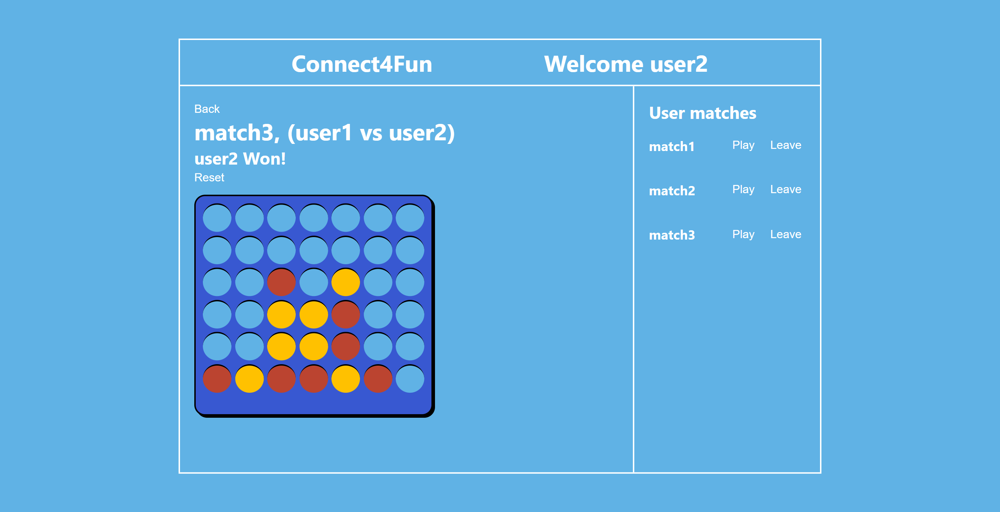
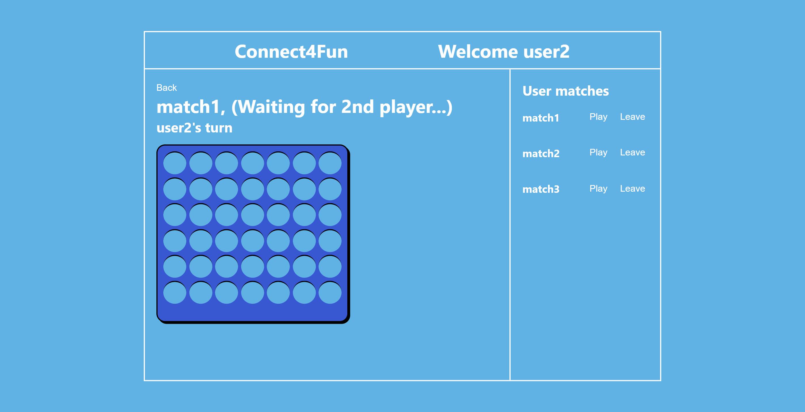

# Connect4Fun 🔴🟡

A app that allows users to play real-time Connect 4.

## Deployment 🚀

https://connect4fun.vercel.app/

## Features

- User account creation
- Users can create/join Connect 4 matches with other users
- Matches contain a Connect 4 board and users can click on the column they want to place their piece
- Automatically updates board with each user's move in real-time

## Screenshots 📸

